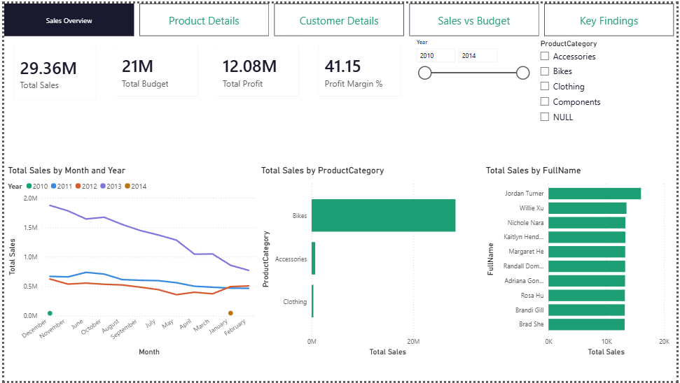
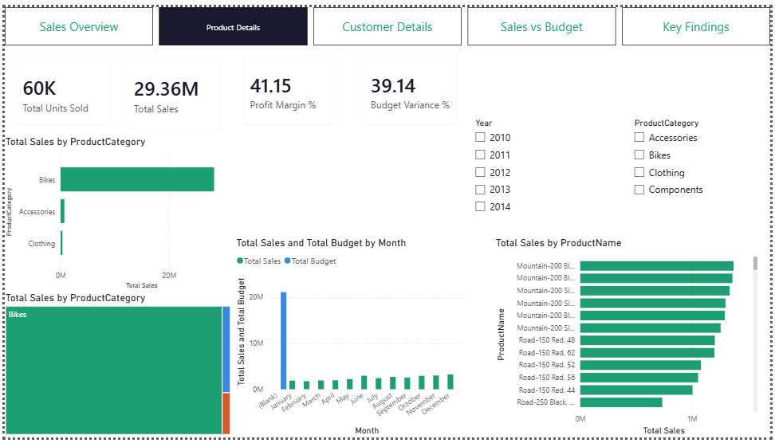
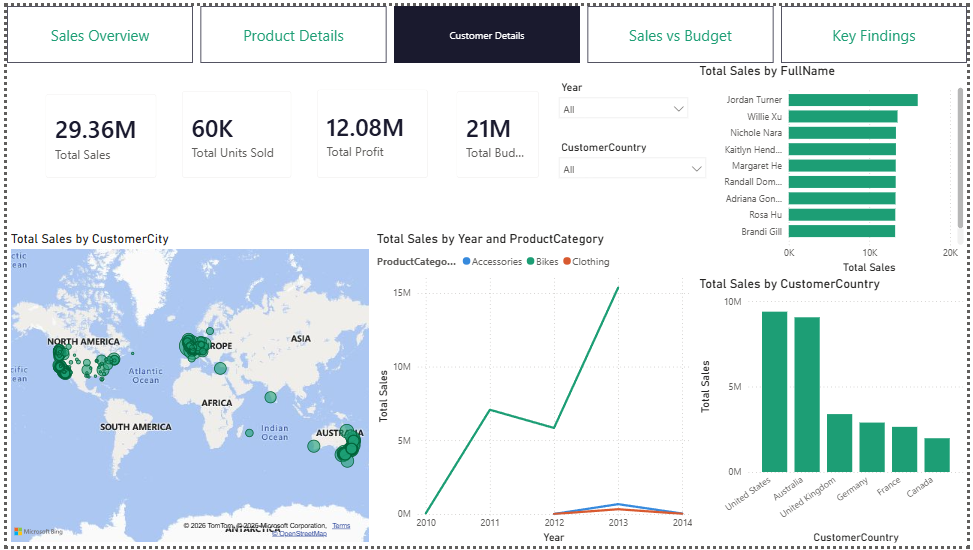
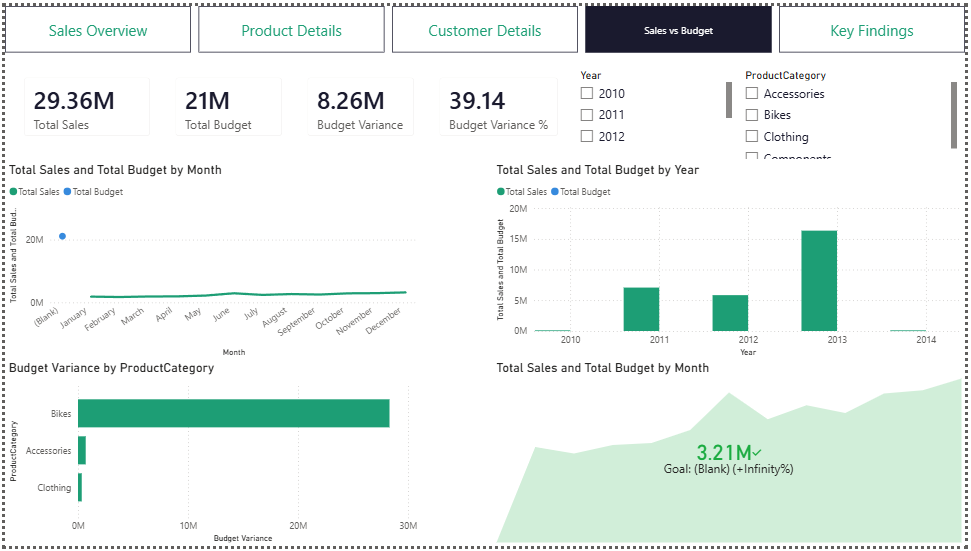
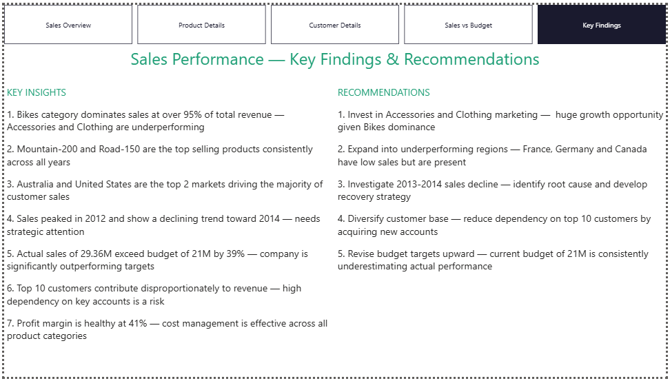

# Sales Performance Dashboard 📊
### SQL Server + T-SQL + Power BI | AdventureWorks Dataset | End-to-End Data Pipeline

---

## Overview

An end-to-end sales analytics solution built using SQL Server for data cleaning and transformation, and Power BI for interactive dashboard development. This project simulates a real-world business intelligence workflow where raw data warehouse data is cleaned using T-SQL, exported as CSVs, and visualized in Power BI with advanced DAX measures and time intelligence.

---

## Dashboard Pages

### 1. Sales Overview


High-level sales KPIs, monthly sales trends by year, sales by product category, and top 10 customers by revenue.

### 2. Product Details


Product category and subcategory drill-down, sales vs budget comparison by month, top 10 products by sales, and treemap visualization.

### 3. Customer Details


Geographic sales map by city, top 10 customers, sales by country, and customer sales trend by year and product category.

### 4. Sales vs Budget


Budget variance analysis, sales vs budget by month and year, KPI visual showing performance against targets.

### 5. Key Findings


Data-driven insights and strategic recommendations derived from the analysis.

---

## Key Insights from the Data

- **Bikes category** dominates sales at over 95% of total revenue — Accessories and Clothing are significantly underperforming
- **Mountain-200 and Road-150** are the top selling products consistently across all years
- **Australia and United States** are the top 2 markets driving the majority of customer sales
- **Actual sales of $29.36M exceed budget of $21M by 39%** — company is significantly outperforming targets
- **Profit margin is healthy at 41%** — cost management is effective across all product categories
- **Top 10 customers** contribute disproportionately to revenue — high dependency on key accounts is a risk
- Sales show a **declining trend from 2012 to 2014** — needs strategic investigation

---

## Technical Skills Demonstrated

| Skill | Details |
|---|---|
| **SQL Server** | Restored AdventureWorksDW2022 database, queried across multiple related tables |
| **T-SQL** | LEFT JOIN across 3+ tables, CASE() for data transformation, ISNULL() for data cleaning, column renaming, ORDER BY, WHERE filtering |
| **Data Modeling** | Star schema with FACT_Sales at center connected to DIM_Calendar, DIM_Customer, DIM_Product, plus FACT_Budget |
| **DAX — Basic** | SUM, DIVIDE, basic aggregations |
| **DAX — Advanced** | SAMEPERIODLASTYEAR, DATESYTD, TOPN, CALCULATE, VAR/RETURN pattern |
| **Power BI** | Map visual, KPI visual, Treemap, Line/Bar/Column charts, Page Navigator, custom theme |
| **End-to-End Flow** | SQL Server → CSV export → Power BI — exactly the real-world BI analyst workflow |

---

## SQL Cleaning Scripts

### DIM_Calendar
```sql
SELECT 
    DateKey,
    FullDateAlternateKey AS Date,
    EnglishDayNameOfWeek AS Day,
    WeekNumberOfYear AS WeekNo,
    EnglishMonthName AS Month,
    LEFT(EnglishMonthName, 3) AS MonthShort,
    MonthNumberOfYear AS MonthNo,
    CalendarQuarter AS Quarter,
    CalendarYear AS Year
FROM [AdventureWorksDW2022].[dbo].[DimDate]
WHERE CalendarYear >= 2010
```

### DIM_Customer
```sql
SELECT 
    c.CustomerKey,
    c.FirstName + ' ' + c.LastName AS FullName,
    CASE c.Gender 
        WHEN 'M' THEN 'Male' 
        WHEN 'F' THEN 'Female' 
    END AS Gender,
    c.DateFirstPurchase,
    g.City AS CustomerCity,
    g.EnglishCountryRegionName AS CustomerCountry
FROM [AdventureWorksDW2022].[dbo].[DimCustomer] c
LEFT JOIN [AdventureWorksDW2022].[dbo].[DimGeography] g
    ON c.GeographyKey = g.GeographyKey
ORDER BY c.CustomerKey ASC
```

### DIM_Product
```sql
SELECT 
    p.ProductKey,
    p.EnglishProductName AS ProductName,
    p.Color,
    p.StandardCost,
    p.ListPrice,
    ps.EnglishProductSubcategoryName AS ProductSubcategory,
    pc.EnglishProductCategoryName AS ProductCategory,
    ISNULL(p.Status, 'Outdated') AS ProductStatus
FROM [AdventureWorksDW2022].[dbo].[DimProduct] p
LEFT JOIN [AdventureWorksDW2022].[dbo].[DimProductSubcategory] ps
    ON p.ProductSubcategoryKey = ps.ProductSubcategoryKey
LEFT JOIN [AdventureWorksDW2022].[dbo].[DimProductCategory] pc
    ON ps.ProductCategoryKey = pc.ProductCategoryKey
ORDER BY p.ProductKey ASC
```

### FACT_InternetSales
```sql
SELECT 
    ProductKey,
    OrderDateKey,
    DueDateKey,
    ShipDateKey,
    CustomerKey,
    SalesOrderNumber,
    SalesAmount,
    TaxAmt,
    Freight,
    SalesAmount - TaxAmt - Freight AS NetSales,
    OrderQuantity,
    UnitPrice,
    TotalProductCost,
    SalesAmount - TotalProductCost AS GrossProfit
FROM [AdventureWorksDW2022].[dbo].[FactInternetSales]
WHERE LEFT(CAST(OrderDateKey AS VARCHAR), 4) >= '2010'
ORDER BY OrderDateKey ASC
```

---

## Custom DAX Measures

```dax
-- Total Sales
Total Sales = SUM(FACT_Sales[SalesAmount])

-- Profit Margin %
Profit Margin % = DIVIDE([Total Profit], [Total Sales], 0) * 100

-- Budget Variance
Budget Variance = [Total Sales] - [Total Budget]

-- Year over Year Growth
Sales YoY % = 
VAR CurrentYearSales = [Total Sales]
VAR PreviousYearSales = 
    CALCULATE([Total Sales], 
        SAMEPERIODLASTYEAR(DIM_Calendar[Date]))
RETURN DIVIDE(CurrentYearSales - PreviousYearSales, PreviousYearSales, 0) * 100

-- Cumulative Sales YTD
Cumulative Sales = 
CALCULATE([Total Sales], DATESYTD(DIM_Calendar[Date]))
```

---

## Data Model — Star Schema

```
                    DIM_Calendar
                         |
DIM_Customer ──── FACT_Sales ──── DIM_Product
                         
FACT_Budget ──── DIM_Calendar
```

- `FACT_Sales` — center fact table with 60K+ sales transactions
- `DIM_Calendar` — date dimension for time intelligence
- `DIM_Customer` — customer demographics and geography
- `DIM_Product` — product hierarchy (Category → Subcategory → Product)
- `FACT_Budget` — monthly sales budget targets

---

## Dataset

**AdventureWorks Data Warehouse 2022**
- Source: [Microsoft SQL Server Samples](https://github.com/Microsoft/sql-server-samples/releases/tag/adventureworks)
- Industry: Bicycle manufacturer (Adventure Works Cycles)
- Data: Internet sales transactions 2010–2014
- Tables used: FactInternetSales, DimCustomer, DimProduct, DimDate, DimGeography, DimProductSubcategory, DimProductCategory

**Sales Budget**
- Source: [AsifRashid01/SalesAnalysis_SQL_PowerBI](https://github.com/AsifRashid01/SalesAnalysis_SQL_PowerBI)
- Monthly budget targets by period

---

## Tools Used

- **SQL Server Express 2025** — database hosting
- **SSMS 22** — SQL query writing and CSV export
- **Power BI Desktop** — dashboard development
- **DAX** — custom measures and time intelligence
- **Excel** — budget data source

---

## Project Structure

```
Sales-Dashboard-PowerBI/
│
├── Sales_Dashboard.pbix           ← Power BI file
├── README.md                      ← this file
│
├── sql/
│   ├── DIM_Calendar_Clean.sql
│   ├── DIM_Customer_Clean.sql
│   ├── DIM_Product_Clean.sql
│   └── FACT_InternetSales_Clean.sql
│
├── csv/
│   ├── DIM_Calendar_Export.csv
│   ├── DIM_Customer_Export.csv
│   ├── DIM_Product_Export.csv
│   └── FACT_InternetSales_Export.csv
│
├── images/
│   ├── page1_sales_overview.png
│   ├── page2_product_details.png
│   ├── page3_customer_details.png
│   ├── page4_sales_vs_budget.png
│   └── page5_key_findings.png
│
└── budget/
    └── SalesBudget.xlsx
```

---

## How to Run

1. Install [SQL Server Express](https://www.microsoft.com/en-us/sql-server/sql-server-downloads) and [SSMS](https://aka.ms/ssmsfullsetup)
2. Download and restore [AdventureWorksDW2022.bak](https://github.com/Microsoft/sql-server-samples/releases/tag/adventureworks)
3. Run the 4 SQL scripts in `sql/` folder to generate clean CSVs
4. Install [Power BI Desktop](https://powerbi.microsoft.com/desktop/)
5. Open `Sales_Dashboard.pbix`
6. Update data source paths to point to your `csv/` folder
7. Click **Refresh** to reload data

---

## Connect With Me

- GitHub: [ManishRamKP](https://github.com/ManishRamKP)

